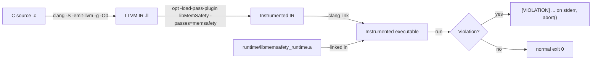

# Architecture & Data Flow

## Pipeline

`driver/memsafec` is the single command that chains the first three steps.

## Modules

### `src/` — the instrumentation pass (Vikas)

| Unit | Responsibility | In | Out |
|---|---|---|---|
| `IRScanner` | Walk a `Function`, classify memory operations into work lists | `llvm::Function&` | `ArrayAccess[]`, `PtrDeref[]`, `HeapCall[]` |
| `CheckInjector` | Declare runtime entry points; insert guard calls via `IRBuilder` | a work-list item | mutated IR |
| `MemSafety` | New-PM plugin registration; drives Scanner → Injector per function | `llvm::Module&` | `PreservedAnalyses` |

Detection rules:

- **Array access** — a `load`/`store` reached through a `getelementptr` whose
  base object is an `alloca`/`GlobalVariable` of `ArrayType` with a static
  length. Emits `boundscheck(base, elem_size, len, index, loc)` before the
  access.
- **Pointer dereference** — any other `load`/`store` whose pointer operand is
  not a direct `alloca`/global. Emits `ptrcheck(ptr, loc)` before the access.
- **Heap call** — a direct call to `malloc`/`calloc` (emit `heap_register`
  after) or `free` (emit `heap_release` before). `realloc` is recognised and
  skipped.

`loc` is a `"file:line"` string recovered from `!dbg` metadata, or
`"<unknown>"`.

### `runtime/` — the check library (Yohann)

Plain C, no LLVM dependency, built as `libmemsafety_runtime.a`.

- **Allocation metadata table** — one open-addressing hash table
  `base_ptr → { size, freed, alloc_site }`, grows past a 70% load factor.
- `heap_register` / `heap_release` — insert / mark-freed; a release of an
  unknown pointer is *invalid free*, of an already-freed pointer *double free*.
  Freed entries are retained so `ptrcheck` can still see *use-after-free*.
- `boundscheck` — range-checks `index` against `[0, len)`.
- `ptrcheck` — NULL → *null dereference*; freed table entry → *use-after-free*.
- `report_violation` — prints `[VIOLATION] <type> at <loc>, addr=<addr>` to
  stderr and `abort()`s (exit 134). Chosen over `exit(1)` so the pass/fail
  signal is unambiguous and the unsafe access never executes.

### `driver/` — `memsafec` (Prajwal)

Bash wrapper: `memsafec [-v] [--no-instrument] input.c -o out`. Plugin and
runtime paths default to `build/` and are overridable via `MEMSAFE_PLUGIN` /
`MEMSAFE_RT` / `MEMSAFE_CLANG` / `MEMSAFE_OPT`.

### `benchmarks/` — the test corpus (Prajwal / Yohann)

`safe/` (must run clean) and `unsafe/` (must be detected). `run_all.sh` builds
each with `memsafec`, checks exit code + stderr against the expected-result
table, and prints a pass/fail/xfail summary. `XFAIL` rows are documented
limitations and do not fail the suite.
